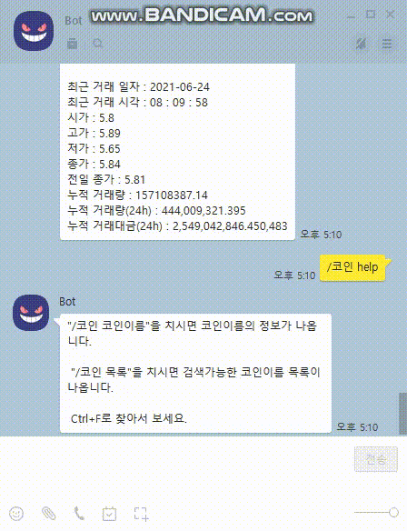

# 코인 조회 봇

**command : "/코인 코인이름", "/코인 목록"**

upbit api를 이용하여 코인 조회


### 실행화면




### 시작하기 전

https://cafe.naver.com/nameyee/32796

https://cafe.naver.com/nameyee/33396

위 두개 글을 참고하여 결과를 출력해보면서 어떻게 왜 썼는지 보면서 제 방식대로 수정하여 작성하였습니다.

처음에 api url을 신청안하고 그대로 써도 되는건가 싶어 방장님한테 물어봤는데, 질문을 하고나니까 개발자센터에 공개되있는 url인걸 확인하여 저도 그냥 사용하였습니다. 

다음부터 좀 더 자세하게 찾아보고 질문하겠습니다!

https://docs.upbit.com/reference#시세-종목-조회

출력 결과값은 주변 친구들한테 코인볼 때 뭐보는지 물어보고, 거래소에 어떻게 출력되는지 보면서 
해당 값들을 필터링해서 넣어놨습니다.

  

### 과정

<strong>0. response()</strong>

실행부분

```javascript
function  response(room, msg, sender, isGroupChat, replier, imageDB, packageName) {
    var cmd = msg.split(" ")[0];
    coinName = msg.split(" ")[1];
    let result;
    let temp;
    if (cmd == "/코인" || cmd.toLowerCase() == "/coin") {
      switch(coinName){
        case "목록":case "list":
         getAllCoinList(coinName);
         result = coinListResult; 
        break;
        case "help":
         result = helpMessage;
        break;
        default:
          temp = getAllCoinList(coinName);
          if(temp == null || temp == ""){
            result = "잘못된 이름 입니다.";
          }
          else{
            result = getCoinInfo(temp);
         } 
        break;
      }
      
    }
    replier.reply(result);
}
```

* "/코인" or "/coin"으로 올시 동작.
* /coin의 경우 들어온 값을 전부 소문자로 바꿔 일치하는지 확인. >> 대.소문자 섞여도 검색가능.
* "목록" or "list"가 오면 코인목록을 보여줌.
* help는 도움메세지 출력.
* 그 외의 경우 코인의 정보를 들고 옵니다.
* 

<strong> 1. getAllCoinList()</strong>

모든 코인의 목록을 가져오는 메소드입니다.

```javascript
function getAllCoinList(coinName) { 
    let datas = Utils.getWebText(allUrl).replace(/(<([^>]+)>)/g, "").trim(" ","");
    let allDatas = JSON.parse(datas);
    let findBit;
    for(var i in allDatas){
      let all = allDatas[i];
      let coinKorName = all.korean_name;
      if(coinName=="목록" || coinName=="list"){
          coinList.push(all.korean_name);
      }else if(coinName == coinKorName){
        findBit = all.market.split("-")[1];
      }
    }
    removeDuplicate();
    return findBit;
}
```

만약에 코인이름 부분이 목록이나 list로 오면, 일단 모든 한국이름을 coinList에 넣고, 
그다음 removeDuplicate() 메소드를 통해 중복제거처리를 합니다.


전체 조회를 하게되면

```text
[
    {
        "market": "KRW-BTC",
        "korean_name": "비트코인",
        "english_name": "Bitcoin"
    },
    ...
]
```

이런 형태로 넘오오는데, 배열을 돌면서 korean_name값이 내가 검색할려고 입력했던 coinName이랑 같으면

그 객체의 market의 'KRW-ㅇㅇㅇ'에서 뒷부분을 잘라냅니다.

이 뒷부분은 Ticker조회(해당 이름에 대한 코인 조회)에서 사용됩니다.


<strong>2. removeDuplicate()</strong>

```javascript
function removeDuplicate(){
   const set = new Set(coinList);
   coinListResult = Array.from(set);
}
```

중복제거하는 방법 중에 Set이란걸 처음 알게 되었습니다.
Set객체는 값 콜렉션으로, 삽입 순서대로 요소를 순회할 수 있습니다.
하나의 Set내 값은 한 번만 나타날 수 있고, 즉 어떤 값이든 Set콜렉션 내에서 유일합니다.


<strong>3. getCoinInfo()</strong>

코인의 정보를 가져오는 부분입니다.(더러움주의)

```javascript
function getCoinInfo(temp){
  let datas = Utils.getWebText(url+temp).replace(/(<([^>]+)>)/g, "").trim(" ","");
  let tempDatas = JSON.parse(datas);
  
  let trade_date = tempDatas[0].trade_date;
  let trade_time = tempDatas[0].trade_time;
  let opening_price = tempDatas[0].opening_price;
  ~~중략~~
  
  trade_date = trade_date.replace(/(\d{4})(\d{2})(\d{2})/g, '$1-$2-$3');
  trade_time = trade_time.replace(/(\d{2})(\d{2})(\d{2})/g, '$1 : $2 : $3');
  opening_price = filterNumber(opening_price);
  ~~중략~~
  signed_change_rate = (signed_change_rate * 100).toFixed(2);
  acc_trade_volume = acc_trade_volume.toFixed(2);
  acc_trade_volume_24h = filterNumber(acc_trade_volume_24h.toFixed(3));
  acc_trade_price_24h = filterNumber(acc_trade_price_24h);
  
  let change;
  switch(tempDatas[0].change){
    case "RISE":
     change = "📈📈📈 "+signed_change_price+"("+signed_change_rate+"%) 상승 📈📈📈";
    break;
    case "FALL":
    change = "📉📉📉 "+signed_change_price+"("+signed_change_rate+"%)하락 📉📉📉";
    break;
    case "EVEN":
    change = "📊📊📊보합📊📊📊";
    break;
  }
  let now = getCurrent();
  let coinInfo = coinName + "(" + temp + ") " + "정보\n\n"
  + "⏰검색 시간⏰\n" + now + "\n\n"
  + change
  + "\n\n최근 거래 일자 : " + trade_date 
  + "\n최근 거래 시각 : " + trade_time
  + "\n시가 : " + opening_price
  + "\n고가 : " + high_price
  + "\n저가 : " + low_price
  + "\n종가 : " + trade_price
  + "\n전일 종가 : " + prev_closing_price
  + "\n누적 거래량 : " + acc_trade_volume
  + "\n누적 거래량(24h) : " + acc_trade_volume_24h
  + "\n누적 거래대금(24h) : " + acc_trade_price_24h;
  
  return coinInfo;
}
```

response()에서 default부분에 temp에 아까 뒷부분을 저장해놓은걸 볼 수 있습니다.

url뒤에 temp를 붙여 해당 이름의 정보를 검색합니다.

가져온 데이터에서 필요한 데이터를 가져와 변수 하나하나 저장해줍니다.


<strong>넘어오는 데이터 (ex - 비트코인)</strong> 

```text
[
    {
        "market": "KRW-BTC",
        "trade_date": "20180418",
        "trade_time": "102340",
        "trade_date_kst": "20180418",
        "trade_time_kst": "192340",
        "trade_timestamp": 1524047020000,
        "opening_price": 8450000,
        "high_price": 8679000,
        "low_price": 8445000,
        "trade_price": 8621000,
        "prev_closing_price": 8450000,
        "change": "RISE",
        "change_price": 171000,
        "change_rate": 0.0202366864,
        "signed_change_price": 171000,
        "signed_change_rate": 0.0202366864,
        "trade_volume": 0.02467802,
        "acc_trade_price": 108024804862.58254,
        "acc_trade_price_24h": 232702901371.09309,
        "acc_trade_volume": 12603.53386105,
        "acc_trade_volume_24h": 27181.31137002,
        "highest_52_week_price": 28885000,
        "highest_52_week_date": "2018-01-06",
        "lowest_52_week_price": 4175000,
        "lowest_52_week_date": "2017-09-25",
        "timestamp": 1524047026072
    }
]
```


<strong>데이터 필터링</strong>

```javascript
 trade_date = trade_date.replace(/(\d{4})(\d{2})(\d{2})/g, '$1-$2-$3');
 trade_time = trade_time.replace(/(\d{2})(\d{2})(\d{2})/g, '$1 : $2 : $3');
```

* replace()를 이용하여 년도에 ' - ' 로 구분해주고, 시간은 ' : '를 추가해주었습니다.


```javascript
 opening_price = filterNumber(opening_price);
```

* filterNumber()메소드를 이용하여 1000자리마다 콤마(,)를 추가했습니다.


```javascript
acc_trade_volume = acc_trade_volume.toFixed(2);
```

* 이번에 새로알게 된 건데 toFixed(): 
  Number 객체를 주어진 `digits` 만큼의 소수점 이하 자리수를 정확하게 갖는 문자열 표현으로 반환합니다. 소수점 이하가 길면 숫자를 반올림하고, 짧아서 부족할 경우 뒤를 0으로 채울 수 있습니다.


```javascript
switch(tempDatas[0].change){
    case "RISE":
     change = "📈📈📈 "+signed_change_price+"("+signed_change_rate+"%) 상승 📈📈📈";
    break;
    case "FALL":
    change = "📉📉📉 "+signed_change_price+"("+signed_change_rate+"%)하락 📉📉📉";
    break;
    case "EVEN":
    change = "📊📊📊보합📊📊📊";
    break;
  }
```

* 코인에서 아무래도 상승인지 하락인지 중요한거같아 change의 상태에 따라 다른 메세지를 출력하게 하였습니다.


```javascript
let now = getCurrent();
let coinInfo = coinName + "(" + temp + ") " + "정보\n\n"
+ ~~ 중략 ~~
```

* 마지막으로 getCurrent()메소드를 이용해 현재 시간을 가져오고, 필요한 정보들을 coinInfo에 작성하여 최종 결과 메세지를 출력합니다.


<strong>4. filterNumber()</strong>

```javascript
function filterNumber(price){
  return price.toString().replace(/\B(?=(\d{3})+(?!\d))/g, ',');
}
```

1000단위 마다 콤마(,)를 추가하는 메소드.


<strong>5. getCurrent()</strong>

```javascript
function getCurrent(){
  let today = new Date();
  let year = today.getFullYear();
  let month = today.getMonth()+1;
  let date = today.getDate();
  let dayArr = ['일','월','화','수','목','금','토'];
  let day = today.getDay();
  let hour = today.getHours();
  let min = today.getMinutes();
  let sec = today.getSeconds();
  
  let resultToday = year+'년 '+month+'월 '+date+'일 '+dayArr[day]+'요일 \n'
   + hour + '시 ' + min + '분 ' + sec + '초';
  return resultToday;
}
```

Date객체의 메소드들을 이용하여 내가 원하는 형태로 커스텀해서 시간을 출력합니다.
Month()는 0부터라 +1.


### 새로 찾아본 것

* Set객체
* toFixed()
* 정규식 관련


### 참고

https://mizzo-dev.tistory.com/entry/JavaScript정규식-숫자에-1000단위로-콤마쉼표-구분자-넣기<br/>
https://hianna.tistory.com/422<br/>
https://developer.mozilla.org/ko/docs/Web/JavaScript/Reference/Global_Objects/Set<br/>
https://developer.mozilla.org/ko/docs/Web/JavaScript/Reference/Global_Objects/Number/toFixed<br/>
https://upbit.com/exchange?code=CRIX.UPBIT.KRW-BTC<br/>
https://docs.upbit.com/reference#시세-종목-조회<br/>
https://docs.upbit.com/reference#ticker현재가-내역<br/>
https://regex101.com/<br/>


