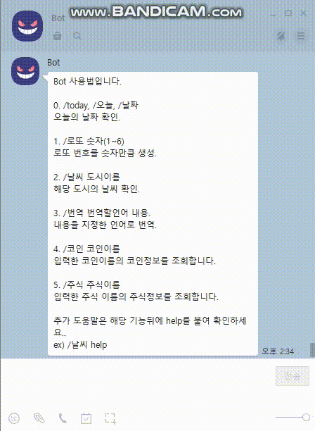

# 주식 조회 봇(Jsoup 연습)

**command : /주식 주식이름, /주식 help**

네이버 검색결과를 토대로 주식을 조회.

### 실행화면




Utils.getWebText를 매번사용해왔기에 이번에는 Jsoup을 이용해서 해보려고 한다.

Jsoup을 이용해 해당 html을 긁어와 필요한부분의 데이터를 selelct해서 출력하는 형식.

Utils.getWebText()의 경우, jsoup을 통해 get요청을 날린 결과물을 반환하는 것.

Jsoup에 대한 설명은 아래 글들을 참고하였습니다.

https://cafe.naver.com/nameyee/30969
https://cafe.naver.com/nameyee/25306
https://cafe.naver.com/nameyee/31299
https://cafe.naver.com/nameyee/20799


### 과정

<strong>1. 실행함수</strong>

```javascript
const Jsoup = org.jsoup.Jsoup;
let helpMessage = "도움말 \n '/주식 주식이름'으로 검색을 할 수 있습니다.";
let url = 'https://search.naver.com/search.naver?~~중략~~&query=';
function response(room, msg, sender, isGroupChat, replier, imageDB, packageName) {
     let cmd = msg.split(" ")[0];
     let financeName = msg.split(" ")[1];  
     let result;
     if(cmd=='/주식'){
       switch(financeName){
         case 'help':case '':case undefined:
         result = helpMessage;
         break;
         default:
         result = getFinanceInfo(financeName);
         break;
       }
       replier.reply(result);
       
     }                     
}
```

/주식 주식이름을 통해 결과를 조회함.

/주식,/주식 , /주식 help : helpMessage 출력.

주식이름을 가지고 getFinanceInfo()메소드를 실행.


<strong>2. getFinanceInfo()</strong>

```javascript
function getFinanceInfo(fname){
  let resultMessage;
  let fetchUrl = url + fname;
  let data = Jsoup.connect(fetchUrl).get();
  let name = data.select(".stk_nm").text();
  let spt_con = data.select(".spt_tlt > h3 > a > span.spt_con > strong").text();
  
  if(spt_con){
      let change = data.select(".spt_tlt > h3 > a > span.spt_con > span.n_ch > .blind").text();
      let ch_price = data.select(".spt_tlt > h3 > a > span.spt_con > span.n_ch > em").text();
        ~~ 중략 ~~
      if(cp_change=='상승'){
        cp_change = '+';
      }else {
        cp_change = '-';
      }

      resultMessage = name + ' 주식\n'
               + '\n지수 : ' + spt_con
               + '\n상승/하강 : ' + change
               + '\n변동 : ' + ch_price
               + '\n전일종가 : ' + pcp
               + '\n고가 : ' + hp
               + '\n저가 : ' + lp
               + '\n거래량 : ' + vl
               + '\n시가 총액 : ' + mc
               + '\n코스피 : ' + cp_spt_con + " " +cp_change + cp_ch_price;
      }else{
    resultMessage = '해당 이름의 주식이 없습니다.\n정확한 이름으로 검색 해주세요.';
  }
  return resultMessage;
}
```

받아온 fname을 url뒤에다가 붙인다.

F12누르고 값들을 찾아서 위치를 selelct()안에 넣어줌.

받은 값들을 최종 출력할 메세지에 알맞게 넣음.


### 참고

https://cafe.naver.com/nameyee/30969
https://jinseongsoft.tistory.com/156
https://cafe.naver.com/nameyee/33244
https://cafe.naver.com/nameyee/25306
https://cafe.naver.com/nameyee/31299
https://cafe.naver.com/nameyee/20799