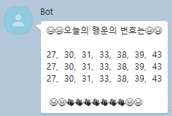
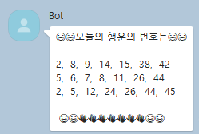

# 로또 번호생성 봇

**command : '/로또 숫자(1~6)', '/로또 help'**	 (/lotto로 가능)

숫자만큼 로또번호 7개를 생성하기.

### 실행화면


### 과정

* help가오면 도움말 메세지를 출력.

* 1~ 6까지면 로또 번호 생성 후 출력.

* 아닌 경우 helpMessage출력.
* 명령어는 /로또 또는 /lotto면 출력함.

```javascript
function response(room, msg, sender, isGroupChat, replier, imageDB, packageName) {
  let cmd = msg.split(" ")[0];
  let repeat = msg.split(" ")[1];
  let result;
  if(repeat == "help"){
    helpMessage = '도움말 입니다.😃 \n입력방법 : \n"/로또 숫자(1~6)"\n'
    + '❤️🧡💛💚💙💜';
    result = helpMessage;
  }
  else if(1<= repeat && repeat <= 6){
    result = makeLotto(repeat);
  }
  else {
    result = helpMessage;
  }
  
  if(cmd=="/로또" || cmd=="/lotto"){
    replier.reply(result);
  }
}
```


<strong>1. makeLotto()</strong>

로또 번호를 생성하는 함수

<strong>1-1. 받은 반복횟수만큼 반복을 한다.</strong>

```javascript
for(let i=0; i<repeat; i++){ 
	~~~ 중략 ~~~
}
```


<strong>1-2. 랜덤생성한 번호를 저장한 배열의 길이가 7될때 까지 반복</strong>

**indexOf()**를 활용 해 같은 값이 있는지 없는지 확인하고, 없는 경우 배열에 추가함.

```javascript
while(lottoArr.length!=7){
    let num = Math.floor(Math.random()*45) + 1; // 0~44라서 +1
    if(lottoArr.indexOf(num)==-1){
    	lottoArr.push(num);      
 	}
}
```


<strong>1-3. 생성된 배열을 정렬 </strong>

**sort()**를 이용하여 낮은 숫자 부터 정렬함.

```javascript
lottoArr.sort(function(a, b) {
    return a - b;
});
```


<strong>1-4. 배열의 요소를 문자열 변환</strong>

**join()**을 이용하여 배열의 요소들을 문자열로 변환 하고, 결과 메세지에 추가합니다.

```javascript
let arr = lottoArr.join(',  ');
resultMessage += arr + '\n';
```


<strong>1-5. 배열 초기화</strong>

**splice()**를 이용하여 배열 요소를 초기화 해줍니다.

```javascript
lottoArr.splice(0);
```


### Trouble Shooting

**배열 초기화**

처음에 다짜고나니까 결과가 아래 사진처럼 같은 숫자가 반복하면서 나왔습니다.



왜 그런가 생각해보니 한번 생성하고, 초기화를 안해줘서 한번 생성한 후에 배열의 길이는 계속 7이 되어 같은 배열을 출력하는 것 이였습니다.

splice를 이용하여 배열초기화를 해주니 정상동작 하였습니다.




이것 저것 메소드를 많이 사용해 볼 수 있어 재밋었던 봇이였습니다.


### 참고

https://developer.mozilla.org/ko/docs/Web/JavaScript/Reference/Global_Objects/Array/indexOf

https://developer.mozilla.org/ko/docs/Web/JavaScript/Reference/Global_Objects/Array/join

https://developer.mozilla.org/ko/docs/Web/JavaScript/Reference/Global_Objects/Array/sort

https://developer.mozilla.org/ko/docs/Web/JavaScript/Reference/Global_Objects/Array/splice