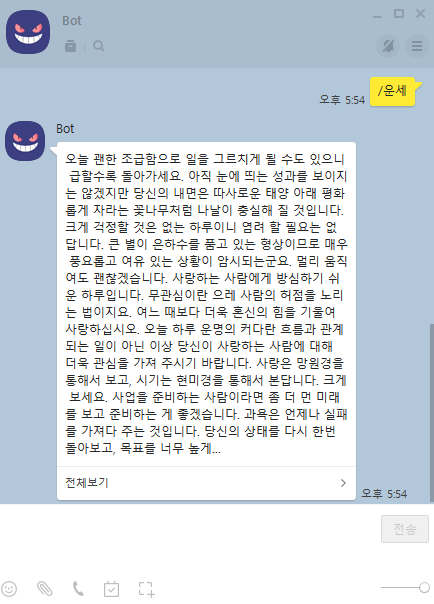

# 운세 조회 봇 (별자리)

<strong>command : /운세</strong>

사용자 정보(생일)을 가져와 네이버 별자리운세 조회

### 실행화면



처음 계획했던 거 중 마지막 기능 운세봇입니다.

지인들 방에서만 쓸려 했기 때문에 동의를 구하고, 생일 (월 일)로된 txt를 저장하여 그 파일을 읽어 별자리 운세를 구하려 하였습니다.

파일 읽고, 쓰는거까지 할려고했는데 오픈 톡 방에 도배사고가 나서 파일쓰기 까지는 구현하지 않았습니다..

~~원인은 메신저봇이 카톡알림을 가지고 메세지를 답변하는데 이게 듀얼메신저로 부계정을 **한 기기에서 같이 돌리다보니 알림설정을 잘못해서 발생**한거 같음~~


<strong>+</strong>

글 작성중에 왠지 찾은거 같은데

```javascript
if (cmd == '/운세') {
    result = readFile(sender);
}
replier.reply(result);
```

이부분에서 '/운세'를 안쳐도 알림을 안쳐도 알림이 온 톡방에 그냥 다 답장해버린거 같음.


### 과정

<strong> 0. 실행함수 </strong>

```javascript
function response(room, msg, sender, isGroupChat, replier, imageDB, packageName) {

  let cmd = msg;
  let result;
  if (cmd == '/운세') {
    result = readFile(sender);
    replier.reply(result);
  }
}
```

명령어 입력시 파일을 읽어 결과를 답해줌.


<strong>1. readFile()</strong>

파일을 읽는함수

```javascript
let path = 'sdcard/msgbot/database/';
function readFile(sender) {
  let fetchPath = path + sender + '.txt'
  let birth = FileStream.read(fetchPath);
  let resultMessage;
  if (!birth) {
    resultMessage = '등록되지않았습니다.₩n관리자에게 문의해주세요.';
  } else {
    let star = filterStar(birth);
    resultMessage = getLuckyInfo(star);

  }
  return resultMessage;
}
```

해당 경로에 읽은파일이 없으면 문의 메시지를 답합니다.

파일을 읽었다면 해당 텍스트에 있는  생일(월 일)을 가지고 별자리를 구한 후 결과 메세지를 출력합니다.

TEXT 예시

```text
// 준형.txt
01 04
```


<strong>2. filterStar(birth)</strong>

별자리를 구하는 함수

getTime을 이용하여 시간비교를 해서 별자리를 구합니다.

```javascript
function filterStar(birth) {
  let date = new Date();
  let thisYear = date.getFullYear();

  birth = thisYear + '-' + birth.split(" ")[0] + '-' + birth.split(" ")[1];
  let birthday = new Date(birth).getTime();
  let aquarius = new Date(thisYear + '-02-18').getTime();
  let pices = new Date(thisYear + '-03-20').getTime();
  let aries = new Date(thisYear + '-04-19').getTime();

 ~~ 중략 ~~

  let result = '';
  switch (true) {
    case (birthday <= capricorn):
      result = '염소자리';
      break;
    case (birthday <= aquarius):
      result = '물병자리';
      break;
    case (birthday <= pices):
      result = '물고기자리';
      break;
    ~~ 중략 ~~
    default:
      result = '염소자리';
      break;
  }
  return result;
}
```


<strong>3. getLuckyInfo()</strong>

```javascript
let url = "https://search.naver.com/search.naver?where=nexearch&sm=tab_etc&qvt=0&query=";
function getLuckyInfo(star) {
  let fetchUrl = url + star;
  let data = org.jsoup.Jsoup.connect(fetchUrl).get().select('.infors > .detail > .text').text();
  return data;
}
```

필터링한 별자리를 가지고, naver 별자리 운세의 정보를 가져옵니다.


## 참고

https://deviolet.tistory.com/entry/메신저봇-가이드-레거시-API

