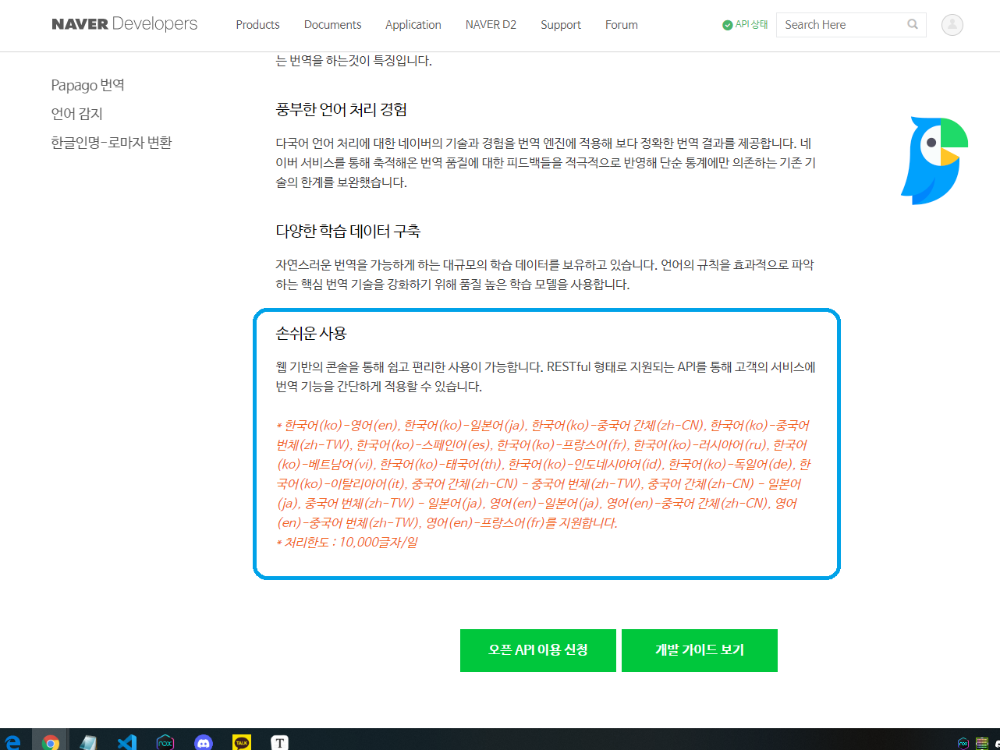

# 파파고 번역 봇

**command : "/번역 번역할언어 내용", "/번역 help"**

### 실행화면


파파고 번역봇을 만들어보자.

처음에 api를 사용해 해보려던 중 메신저봇에
**Api.papagoTranslate(sourceLanguage, targetLanguage, content, errorToString=false)**
라는 내장 API(네이버 API에서 가져옴)가 있다고 합니다.

**번역가능 언어 리스트**



가장 아래쪽에 보면 처리한도가 있어서 나중에 더 많이 사용할 일이 있다면, Api를 신청해서 해야될 듯 합니다.
이번엔 번역시켜보는게 목적이라 가볍게 해보겠습니다.

번역할 언어 : 영어(en), 일본어(ja)


### 과정

<strong>1. 언어 변환</strong>

사용자는 번역할언어를 영어로 쳐주진 않을거 같으니 한글로 들어온걸 영어로 바꿔 줄려 합니다.
평소처럼 if문을 처음에 쓰려다가 includes를 사용해서 좀 더 간결하게 사용할 수 있는걸 봤던 기억(유용한 javascript기법? 이런 내용의 글에서 봤었는데 다시 찾으려니 어디있는지 잘 못찾겠네요 ㅜ)이 나서,
include로 해봤습니다.

```javascript
function response(room, msg, sender, isGroupChat, replier, imageDB, packageName) {
  let cmd = msg.split(" ")[0];
  let lang = msg.split(" ")[1];
  let text;
  let result;
  let arrEnglish = ['영어', 'en'];
  let arrJapanese = ['일본어','일어','ja'];
  if(cmd=='/번역'){
    text = msg.replace(("/번역 "+lang+" "),"");
   
    if(arrEnglish.includes(lang)){
      lang = 'en';
      result = translate(lang, text);
    }else if(arrJapanese.includes(lang)){
      lang = 'ja';
      result = translate(lang, text);
    }else{
      result = helpMessage;
    }
    
    replier.reply(result);
  }
}
```

* arrEnglish, arrJapanese에 각각 입력들어올만한 영어와 일본어를 넣고, 
* 사용자가 입력한 언어가 있는지 includes()로 확인.
* 그 후 각 언어에 맞게 lang을 다시 설정하고, 번역 메소드를 돌립니다.


<strong>2. 내용 추출</strong>

처음엔 평소처럼 split으로 공백기준으로 나누려고 했는데, 생각해보니

"/번역 번역할언어" 뒤에 문장이 올 수도 있고, 아무튼 공백이 들어간 문자가 올 수  있어서 다른 방법을 찾던 중 replace()로 아예 앞의 글자를 빈값으로 바꾸어 문장을 받는 코드를 보았습니다.

그래서 replace()를 이용하여 "/번역 번역할언어" 이 부분을 빈값으로 바꾸고, 남은 값들을 text변수에 저장하여 번역시켰습니다.

```javascript
text = msg.replace(("/번역 "+lang+" "),"");
```


<strong>3. translate</strong>

처음에 언어별로 다른 메소드를 두고, 번역을 시켰다가 보다보니 lang도 같이 들고 가면 되겠다 싶어 
**하나의 메소드로 합쳤습니다.**

**변경 전**

```javascript
function translateEnglish(text){
  let tEnglishMessage = Api.papagoTranslate("ko", "en", text);
  return tEnglishMessage;
}

function translateJapanese(text){
  let tJapaneseMessage = Api.papagoTranslate("ko", "ja", text);
  return tJapaneseMessage;
}
```


**변경 후**

```javascript
function translate(lang, text){
  let translateMessage = Api.papagoTranslate("ko", lang, text);
  return translateMessage;
}
```


### 참고

https://m.blog.naver.com/dt3141592/222000427847

https://developers.naver.com/products/papago/nmt/nmt.md

https://developer.mozilla.org/ko/docs/Web/JavaScript/Reference/Global_Objects/Array/includes

https://developer.mozilla.org/ko/docs/Web/JavaScript/Reference/Global_Objects/String/replace

https://rlawldud7130.tistory.com/5

