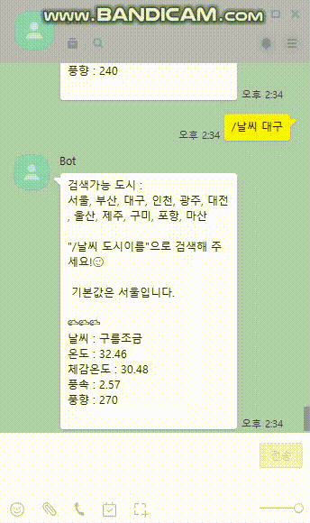

# 날씨 확인 봇

openWeather API를 사용하여 날씨 출력하기.

[사용한 OpenWeather 공식문서](https://openweathermap.org/current)


### 실행화면



### 과정

"/날씨 도시이름"으로 메세지를 받는데 도시이름 부분이 help면 help메세지를, 
다른 도시이름이면 도시이름을 영어로바꾸고 날씨를 얻어서 결과를 출력.

```javascript
function response(room, msg, sender, isGroupChat, replier, imageDB, packageName) {
  var cmd = msg.split(" ")[0];
  var city = msg.split(" ")[1];
  var result;
  if(city=='help'){
    result = helpMessage;
  }else{
    city = filteringCity(city);
    result = getWeather(city);
  }
  
  if(cmd=="/날씨"){
    replier.reply(result);
  }
  
}
```


<strong>0. 요청할 api 및 변수 선언</strong>

```javascript
var url = 'http://api.openweathermap.org/data/2.5/';
var API_KEY ='본인의 API키';
var helpMessage = '검색가능 도시 : \n서울, 부산, 대구, 인천, 광주, 대전, 울산, 제주, 구미, 포항, 마산 \n'
  +'\n"/날씨 도시이름"으로 검색해 주세요!😉\n'
  +'\n 기본값은 서울입니다. \n';
```


<strong>1. getWeather()</strong>

api를 이용하여 데이터를 출력.

```javascript
function getWeather(city){
  let fetchUrl = url+'weather?q='+city+'&units=metric&APPID='+API_KEY+'&lang=kr';
  var data = Utils.getWebText(fetchUrl).replace(/(<([^>]+)>)/g, "").trim(" ","");

  var result = JSON.parse(data);
  let weather = result.weather[0].main;
  let resultMessage = helpMessage + '\n'
    + changeMessage(weather) +'\n날씨 : '
    + result.weather[0].description + '\n온도 : '
    + result.main.temp+' \n체감온도 : ' 
    + result.main.feels_like+' \n풍속 : '
    + result.wind.speed+' \n풍향 : '
    + result.wind.deg+' \n'
  return resultMessage;
}
```

* data는 받아온 데이터를 잘라내는 역할.
* resultMessage는 최종적으로 답장할 메세지 내용

**받아온 데이터.**

```text
<html>
 <head></head>
 <body>
  {
    "coord":{"lon":126.9778,"lat":37.5683},
    "weather":[
        {
        "id":800,"main":"Clear",
        "description":"clear sky","icon":"01d"}
    ],
    "base":"stations",
    "main":{
        "temp":26.01,
        "feels_like":26.01,
        "temp_min":22.69,
        "temp_max":28.42,
        "pressure":1000,
        "humidity":54
    },
    "visibility":10000,
    "wind":{
        "speed":4.63,
        "deg":270
    },
    "clouds":{
        "all":0
    },
    "dt":1624094834,
    "sys":{
        "type":1,
        "id":8105,
        "country":"KR",
        "sunrise":1624047040,
        "sunset":1624100166
    },
    "timezone":32400,
    "id":1835848,
    "name":"Seoul",
    "cod":200
}
 </body>
</html>
```


<strong>2. filteringCity() </strong>

```javascript
function filteringCity(city){
  let filtering;
  switch(city){
    case '서울':
      filtering = 'seoul';
      break;
    case '부산':
      filtering = 'busan';
      break;
    case '대구':
      filtering = 'daegu';
      break;
          
    ~~ 중략 ~~
        
    default:
    filtering = 'seoul';
    break;
  }
  return filtering;
}
```

메세지의 도시이름이 한글로 입력할 꺼기 때문에 영어로 변환해주는 작업.


<strong>3.changeMessage()</strong>

날씨의 종류 (Clear, Clouds, Rain, ...)에 따라 출력메세지에 이모지를 추가.

```javascript
function changeMessage(weather){
  let changing ;
  switch(weather){
    case 'Clear':
    	changing = '☀️☀️☀️';
    break;
    case 'Clouds':
    	changing = '🌥️🌥️🌥️';
    break;
    case 'Rain':case 'Drizzle':
    	changing = '🌧️🌧️🌧️';
    break;
    case 'Thunderstorm':
   		changing = '🌩️🌩️🌩️';
    break;
          
    ~~ 중략 ~~
        
    default:
    changing = weather;
    break;
  }
  return changing;
}
```


### 참고

https://cafe.naver.com/nameyee/book5105233

https://openweathermap.org/current

https://m.blog.naver.com/edisondl/221362757188

https://deviolet.tistory.com/entry/메신저봇-가이드-레거시-API

